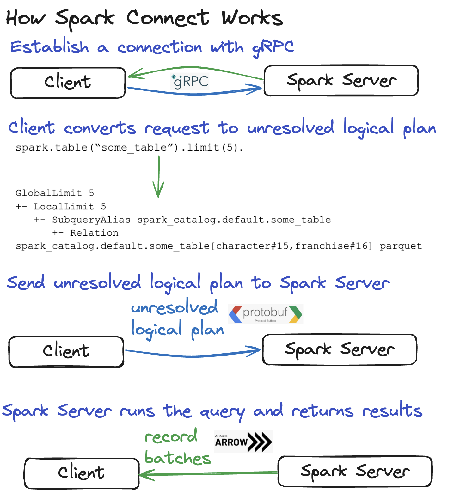

# Chapter 0: Why this tutorial

This goal of this tutorial is to provide a way to easily test with spark on your local setup.

The official [documentation](https://spark.apache.org/docs/latest/api/python/getting_started/testing_pyspark.html#Putting-It-All-Together!) describes how to create test with pyspark.

It requires to have spark server with a spark connect support for it to work as described in the [documentation](https://spark.apache.org/docs/latest/api/python/getting_started/quickstart_connect.html).

As a reminder, this is how spark connect works:

Namely, a specific server needs to be created so your tests can connect to this server and process the data as intended.

## Why it is not enough?

- Launching the server requires some extra requirements on your machine, namely a java virtual machine.

- Launching the server requires a specific script called `start-connect-server.sh` which is to be found

Some data engineers might argue they can just use a spark server already deployed to be able to test; but there are several drawbacks to this approach:

- You are being charged to launch simple tests or run experiments keeping cloud providers very happy
- You slow down the **developer feedback loop** which is the time necessary to implement a feature and validates that no regression has been introduced. A developer is more confident to have no regression when tests are all executed
- You create **external dependencies** that you have no control off. You might encounter issues with testing when the cloud provider is down, or you don't have internet access or someone changes the configuration of the server by accident.

The goal is to have a test environment that is self descriptive, quick to setup, quick to start and reliable.

## How this tutorial is organized?

It's made of multiple chapters that you can go browse in [tutorials](../tutorials/).
